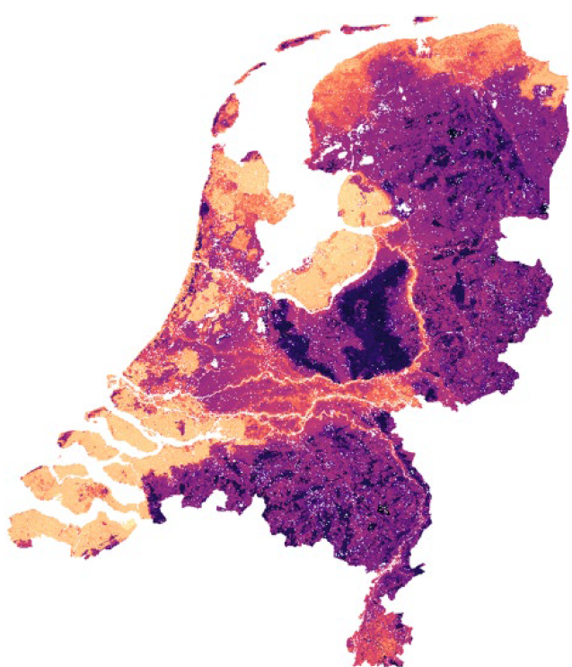

# BIS-3D 

This repository contains scripts and metadata used in the manuscript:

Helfenstein, A., Mulder, V.L., Heuvelink, G.B.M., Okx, J.P. Tier 4 maps of soil pH at 25 m resolution for the Netherlands. Submitted, 2021.

## Model inputs

### Soil point data

The "bodemkunig informatie systeem" (BIS), the soil database of the Netherlands, contains 3 different types of soil data: 

* BPK = "boring" / boreholes to a max of 5 m depth (most go to 1.2 to 2 m depth); the locations are specifically selected (purposive sampling); mostly field observations and little to no laboratory analysis (?)
* PFB = "profielbeschrijving" / soil profile descriptions from soil pit the locations are specifically selected (purposive sampling); Almost always, samples were taken for lab analysis
* LSK = "Landelijke Steekproef Kaarteenheden"; dataset with profile descriptions and samples including lab analysis; stratified random sampling design based on soil type and grondwatertrappe (groundwater), see [Finke et al. 2001](https://library.wur.nl/WebQuery/wurpubs/316229) and [Visschers et al. 2007](https://doi.org/10.1016/j.geoderma.2007.01.008).

In addition there is the "carbon content Netherlands" (CC-NL) dataset, for which LSK sampling sites were revisited 20 years later (2018). Samples were taken for the topsoil (0-30) and for the subsoil (30-100) regardless of location or soil type. Contains a lot of wet chemistry, conventional laboratory analysis as well as spectroscopy measurements (see [Van Tol-Leenders et al. 2019](https://doi.org/10.18174/509781)). The CC-NL has not yet been added to the BIS database (version 7.4).

Only the PFB and LSK datasets contain soil pH data, see [15_soil_BIS_expl_analysis_target_pH.Rmd](15_soil_BIS_expl_analysis_target_pH.Rmd).

### Covariates

The covariates were specifically chosen to represent the CLORPT framework, wherein soil is a function of the soil forming factors climate (CL), organisms (O), relief/topography (R), parent material/geology (P) and time (T; [Dokuchaev, 1899](#references); [Jenny, 1941](#references)). For a descriptive summary of the covariates used in this study, see [covariates_metadata.csv](data/covariates/covariates_metadata.csv) (***Note:*** soil maps were not used as covariates).

### Data accessibility

The model input data do not belong to us and are not provided here. The credentials to access soil point data from the "Bodemkundig Informatie Systeem" (BIS) were removed in the R scripts due to privacy reasons. For accessing soil point data, please see the [Dutch National Key Registry of the Subsurface (BRO, in Dutch)](https://basisregistratieondergrond.nl/) and more detailed information about the [BIS database from Wageningen Environmental Research](https://www.wur.nl/nl/Onderzoek-Resultaten/Onderzoeksinstituten/Environmental-Research/Faciliteitentools/Bodemkundig-Informatie-Systeem-BIS-Nederland.htm).

We can only provide metadata (e.g. README and reclassification table files) and not the covariates themselves. Most of the covariates were attained from the ["GeoDesk" of Wageningen University and Research](https://www.wur.nl/en/research-results/research-institutes/environmental-research/facilities-tools/geodesk.htm).

## Dataset of model outputs (soil pH maps [25m])

The published dataset of the soil pH maps (model outputs) produced using the workflow in this repository are available for download: [Helfenstein et al. 2021, dataset](https://doi.org/10.4121/16451739.v1). The GeoTIFFs can e.g. be opened in a GIS software. The dataset includes mean predictions and estimates of the 5th, 50th (median), and 95th quantile, as well as the 90% prediction interval (PI90) and a categorical map of the accuracy thresholds ("none", A, AA, AAA) based on *GlobalSoilMap* specifications for Tier 4 products ([Arrouays et al., 2015](#references)). These maps are available for six standard depth layers from 0 cm to 5 cm, 5 cm to 15 cm, 15 cm to 30 cm, 30 cm to 60 cm, 60 cm to 100 cm and 100 cm to 200 cm, although the calibrated model can be used to predict at any user-defined depth layer between 0 m and 2 m.

## Model workflow (R scripts)

### 1. Soil data preparation

* [10_db_connect_ODBC.R](10_db_connect_ODBC.R) - Connect to BIS (currently version 7.4) Oracle database (DB) using oracle client basic and odbc driver; example of how to query DB using dbplyr syntax (***Note:*** for model inputs accessibility, see [data accessibility](#data-accessibility))
* [11_soil_CCNL_prep.R](11_soil_CCNL_prep.R) - Compile relevant soil property data and geographic locations of sampling locations of the CCNL dataset and export table of soil property data and 3D coordinates of the CCNL dataset
* [11_soil_PFB_BPK_LSK_prep.R](11_soil_PFB_BPK_LSK_prep.R) - Connect to BIS (currently version 7.4) Oracle database (DB) using oracle client basic and odbc driver, query DB using dplyr syntax, compile relevant soil property data and geographic locations of sampling locations and export table of soil property data and 3D coordinates  
* [12_soil_BIS_master_tibble.R](12_soil_BIS_master_tibble.R) - Combine all BIS soil information: BPK, CC-NL, LSK and PFB lab and field tibbles into one master tibble
* [15_soil_BIS_expl_analysis_BPK.Rmd](15_soil_BIS_expl_analysis_BPK.Rmd) - Exploratory analysis of BPK dataset
* [15_soil_BIS_expl_analysis_LSK_CCNL.Rmd](15_soil_BIS_expl_analysis_LSK_CCNL.Rmd) - Exploratory analysis of LSK and CCNL datasets
* [15_soil_BIS_expl_analysis_metadata.Rmd](15_soil_BIS_expl_analysis_metadata.Rmd) - Exploratory analysis of metadata of BIS datasets (e.g. projects, time, sample age, etc.)
* [15_soil_BIS_expl_analysis_target_SOC_SOM.Rmd](15_soil_BIS_expl_analysis_target_SOC_SOM.Rmd) - Exploratory analysis of soil organic carbon (SOC) and soil organic matter (SOM) point data in BIS
* [15_soil_BIS_expl_analysis_target_pH.Rmd](15_soil_BIS_expl_analysis_target_pH.Rmd) - Exploratory analysis of soil pH point data in BIS
* [16_soil_BIS_remove_Ohorizon_outliers.R](16_soil_BIS_remove_Ohorizon_outliers.R) - Based on findings in exploratory analysis of BIS data (scripts "15_soil_BIS_expl_analysis_[].R"), remove any response data we do not want to include in BIS-3D models (e.g. O horizon ?humus layer above mineral soil observations, any observations where we are certain that they are outliers)

### 2. Covariate preparation

* [20_cov_prep_gdal.R](20_cov_prep_gdal.R) - Assemble & prepare predictors (covariates as raster data):
  + Designate coordinate system (projection)
  + Resample covariates so they have the same origin, cell locations and extent
  + Mask nodata areas (water and areas outside NL) of continuous covariates (categorical covariates masked after reclassification in script [22_cov_cat_recl_gdal_par.R](22_cov_cat_recl_gdal_par.R))
  + Assemble into raster stack and save
* [21_cov_dem_deriv_saga.R](21_cov_dem_deriv_saga.R) - Compute digital elevation model (DEM) derivatives using AHH2 (Dutch DEM, version 2) based on [Hengl & MacMillan, 2019](https://soilmapper.org/)
* [22_cov_cat_recl_gdal_par.R](22_cov_cat_recl_gdal_par.R) - Prepare categorical covariates:
  + Define categorical variables in covariate stack as such
  + Reclassify: combine levels of each categorical covariate into new levels that are more broad
  + Designate NA values and mask categorical covariates
  + Write all covariates to disk (final stack for modelling)
* [25_cov_expl_analysis_clorpt.Rmd](25_cov_expl_analysis_clorpt.Rmd) - Exploratory analysis of covariates, inspecting a few of each CLORPT soil forming factor
* [25_cov_expl_analysis_cont_cat.Rmd](25_cov_expl_analysis_cont_cat.Rmd) - Exploratory analysis of covariates: histogram, map and, if categorical, pie chart of classes of each covariate, grouped into continuous and categorical covariates

### 3. Overlay soil point data with covariates and regression matrix

* [30_regression_matrix.R](30_regression_matrix.R) - Read in prepared covariate stack and soil point data with coordinates; overlay rasters and points and prepare regression matrix (extract covariate values from sampled/observed locations)
* [35_model_data_expl_analysis_pH_KCl.Rmd](35_model_data_expl_analysis_pH_KCl.Rmd) - Exploratory analysis of all input data related to target soil property (soil pH) used for model calibration and validation

### 4. Model calibration (training)

* [40_train_RF_LLO_KFCV_hyperparameter_tuning.R](40_train_RF_LLO_KFCV_hyperparameter_tuning.R) - Tune random forest (RF) hyperparameters:
  + Read in BIS regression matrix and select target (response) variable
  + Turn categorical variables into factors
  + Split into training and test data
  + Fit RF models all using a cross-validation (CV) grouped by location of the training data (requires "caret", "CAST" and "ranger" pkg ("ranger" is preferable because much faster)
  + Different RF models are fit using a full cartesian grid of hyperparameters (e.g. ntree, mtry, node size, splitrule, resampling type and size) and model performance values for each set of hyperparameters is saved
* [41_train_QRF_LLO_KFCV_optimal_model.R](41_train_QRF_LLO_KFCV_optimal_model.R) - Calibrate/train QRF with optimal hyperparameters:
  + Read in regression matrix and tuning grid of hyperparameters specific to chosen target soil property (response/dependent var)
  + Fit QRF model using a cross-validation (CV) grouped by location of the training data (requires "caret", "CAST" and "quantregForest" or "ranger" pkg ("ranger" is preferable because much faster)) and optimal hyperparameters
  + Save trained/fitted/calibrated model to disk 

### Model evaluation (validation/test)

Model were evaluated using accuracy plots (i.e. predicted vs. observed)) and the following metrics: mean error (ME), mean squared error (MSE), root mean squared error (RMSE), model efficiency coefficient (MEC) and the prediction interval coverage probability (PICP) of PI90. Different external accuracy assessment (statistical validation) strategies were used:
* PFB-OOB: out-of-bag observations using PFB dataset
* PFB-CV: cross-validation of PFB dataset
* LSK: independent validation using LSK dataset
* LSK-SRS: design-based inference of the LSK probability sample separated by depth layer.

For more information, see [Helfenstein et al., submitted](#references).

* [50_model_evaluation_all_depths_PFB-OOB_PFB-CV_LSK.R](50_model_evaluation_all_depths_PFB-OOB_PFB-CV_LSK.R) - Model evaluation across all depths combined:
  + Read in target variable regression matrix and fitted model
  + Use "ranger" pkg to predict mean and all quantiles
  + Evaluate map accuracy using 3 strategies:
    - PFB-OOB: out of bag (OOB) calibration data
    - PFB-CV: hold outs from location-grouped 10-fold CV of calibration data
    - LSK: independent validation/test data: LSK/CCNL (***Note***: Here we evaluate over all depths together and therefore cannot account for stratified sampling design of LSK data (LSK-SRS); this is implemented for each depth layer separately in script [51_model_evaluation_depth_layers_PFB-OOB_PFB-CV_LSK_LSK-SRS.R](51_model_evaluation_depth_layers_PFB-OOB_PFB-CV_LSK_LSK-SRS.R)
  + Make predicted vs. observed plots and accuracy metrics for all strategies over all depths combined
  + Include Prediction Interval Coverage Probability (PICP) of PI90 in plots
  + Calculate PICP of all PIs for all strategies (LSK and LSK-SRS are identical).
  + Variable importance plots for (30) most important covariates
  + (Assess validation results using GSM accuracy thresholds (A, AA, AAA), ***not included in manuscript***)
* [51_model_evaluation_depth_layers_PFB-OOB_PFB-CV_LSK_LSK-SRS.R](51_model_evaluation_depth_layers_PFB-OOB_PFB-CV_LSK_LSK-SRS.R) - Model evaluation across all depths separately:
  + Read in target variable regression matrix and fitted model
  + Use "ranger" pkg to predict mean and all quantiles
  + Evaluate map accuracy using 4 strategies ***separated into GSM depth layers***:
    - PFB-OOB: out of bag (OOB) calibration data
    - PFB-CV: hold outs from location-grouped 10-fold CV of calibration data
    - LSK: independent validation/test data: LSK/CCNL
    - LSK-SRS: independent validation/test data (LSK/CCNL) taking into account probability sample, in our case stratified random sampling (SRS) because split into depth layers
  + Model evaluation over space (2D), plotting residuals and PICP of PI90 per GSM depth increment over the entire NL

### Soil maps

* [60_predict_QRF_soil_maps.R](60_predict_QRF_soil_maps.R) - Compute soil maps:
  + Define target variable (response) and target prediction depth
  + Read in fitted quantile regression forest (QRF) model
  + Read in stack of covariates (predictors)
  + Predict response mean and quantiles (e.g. 50th/median, 5th & 95th quantiles) using terra::predict and ranger::predict arguments
  + Calculate PI90 & GSM accuracy thresholds
  + Visualize maps and write rasters of results to disk
* [61_map_soil_properties.R](70_map_soil_properties.R) - Load stack of predicted target soil property rasters and visualize results as plots using "rasterVis" pkg:
  + 5th, 50th (median) and 95th quantile of QRF
  + PI90
  + GSM accuracy thresholds

## Summary of supporting scripts, files and directories

* [R/other](R/other/) - R scripts that are not part of core modelling workflow, i.e. do not need to be re-run when adding new data or changing model parameters.
  + [QRF_comparison_approaches.R](R/other/QRF_comparison_approaches.R) - Benchmark and test different QRF training and predict functions from different packages
  + [color_schemes.R](R/other/color_schemes.R) - Explore different color schemes for continuous and categorical covariates and soil maps
  + [compare_AHN.R](R/other/compare_AHN.R) - Compare different AHN (digital elevation model (DEM) of the Netherlands) versions by subtracting rasters
  + [comparison_SoilGrids_evaluation_depth_layers_LSK-SRS.R](R/other/comparison_SoilGrids_evaluation_depth_layers_LSK-SRS.R) - Map accuracy of SoilGrids for NL using LSK-SRS probability sample as a comparison to BIS-3D maps (based on [51_model_evaluation_depth_layers_PFB-OOB_PFB-CV_LSK_LSK-SRS.R](51_model_evaluation_depth_layers_PFB-OOB_PFB-CV_LSK_LSK-SRS.R) script)
  + [extract_from_raster_comparison.R](R/other/extract_from_raster_comparison.R) - Benchmark and compare different extracting methods (i.e. extracting covariate data at soil observation locations)
  + [make_recl_tbl.R](R/other/make_recl_tbl.R) - Make reclassifying metadata table for each categorical covariate based on ID values in raster S4 attribute table. This script was only run once to create a unique template for each categorical covariate reclassification table **prior** to manually describing and aggregating each class ID. ***CAUTION: Running this script will overwrite all the classes of each categorical covariate that were manually inserted based on expert knowledge!***
  + [merge_dbl_cols.R](R/other/merge_dbl_cols.R) - Tests how to merge double columns in soil point data tabular data in a sensible way
  + [predict_QRF_soil_maps_tiles.R](R/other/predict_QRF_soil_maps_tiles.R) - Predict soil property for each tile of tiled raster stack and then merge back together to get one map of all of the Netherlands (***Note:*** tiling may be useful for users with RAM issues)
  + [predict_qrf_fun.R](R/other/predict_qrf_fun.R) - Modify tweaked version of ranger function so that mean can also be computed directly from QRF (slightly altered from [ISRIC's tweaked QRF predict function](https://git.wur.nl/isric/soilgrids/soilgrids/-/blob/master/models/ranger/predict_qrf_fun.R))
  + [target_prediction_depth_GSM.R](R/other/target_prediction_depth_GSM.R) - Create target *GSM* prediction depth layers
  + [tiling_rasters.R](R/other/tiling_rasters.R) - Functions (sequential and parallel) to tile rasters (***Note:*** tiling may be useful for users with RAM issues; see also [split raster into tiles](https://stackoverflow.com/questions/52484216/split-a-raster-into-5-pixel-x-5-pixel-tiles-in-r))

* [data](data/) - Input data for modelling workflow (***Note:*** for model inputs accessibility, see [model inputs](#model-inputs))
  + [covariates](data/covariates/) - metadata (e.g. README and reclassification table files) of covariates, which are based on the soil forming factors climate, geology, organism and relief (***Note:*** The soil forming factor time is incorporated indirectly in the other soil forming factors since the covariates represent data from different times).
    - [climate](data/covariates/climate/) - README files ([...]_readme.txt) of covariates related to soil forming factor climate
    - [geology](data/covariates/geology/) - README, reclassification table ([...]_reclassify.csv and [...]_reclassify.xlsx) and attribute table of original classes ([...]_attributes.csv) files of covariates related to soil forming factor geology/parent material
    - [organism](data/covariates/organism/) - README, reclassification table, attribute table of original classes and any other metadata files of covariates related to soil forming factor organism (including land cover and land use)
    - [relief](data/covariates/relief/) - README and reclassification table files of covariates related to soil forming factor relief/topography
    - [soil](data/covariates/soil/) - README and any other files of soil maps (***Note:*** These were not used in modelling framework since we did not want to model/map soil properties with existing soil maps and instead only used the soil forming factors)
    - [covariates_metadata.csv](data/covariates/covariates_metadata.csv) - Summary metadata table of all covariates used
    - [covariates_metadata.xlsx](data/covariates/covariates_metadata.xlsx) - Summary metadata table of all covariates used
  + [covariates](data/other/) - Other spatial data not used as covariates (e.g. table of land use classes as designated in BIS database, shapefiles of provincial and country borders and probability sample strata and mapping mask used to assign "no data" values)

* [out](out/) - Intermediary (e.g. changes made to input data) and final model outputs
  + [out/data/covariates/DEM_derivatives](out/data/covariates/DEM_derivatives/) - DEM derivatives produced from AHN2 using [SAGA GIS](http://www.saga-gis.org/) functions in script [21_cov_dem_deriv_saga.R](21_cov_dem_deriv_saga.R), based on approach of [Hengl & MacMillan, 2019](https://soilmapper.org/)
  + [out/data/model](out/data/model/) - Model evaluation and hypertuning outputs
  + [out/figs/explorative](out/figs/explorative/) - Exploratory analysis and descriptive plots of modelling input soil point data
  + [out/figs/models/pH_KCl](out/figs/models/pH_KCl/) - Model evaluation plots: accuracy plots and metrics (ME, MSE, RMSE, MEC, PICP) of the 4 different accuracy assessment (statistical validation) strategies, model residuals over space per depth layer, and variable importance measures
  + [out/maps/explorative](out/maps/explorative/) - Exploratory analysis maps of BIS soil point data, AHN and AHN derivatives
  + [out/maps/other/SoilGrids_v2.0/SoilGrids_phh2o_model_evaluation_LSK_SRS_d.csv](out/maps/other/SoilGrids_v2.0/SoilGrids_phh2o_model_evaluation_LSK_SRS_d.csv) - Model evaluation accuracy metrics of SoilGrids version 2.0 soil pH [H2O] maps of the Netherlands ([Poggio et al., 2021](https://doi.org/10.5194/soil-7-217-2021)).
  + [out/maps/target/pH_KCl/GeoTIFFs](out/maps/target/pH_KCl/GeoTIFFs/) - tif.aux.xml files of pH [KCl] model output maps (***Note:*** Actual maps (GeoTIFFs) can be downloaded here: [Helfenstein et al. 2021, dataset](https://doi.org/10.4121/16451739.v1))
  + [out/maps/target/pH_KCl/pdf](out/maps/target/pH_KCl/pdf/) - PDFs of pH [KCl] maps

## References

Arrouays, D., McBratney, A., Minasny, B., Hempel, J., Heuvelink, G.B.M., MacMillan, R.A., Hartemink, A., Lagacherie, P., McKenzie, N., 2015. The GlobalSoilMap project specifications, in: Proceedings of the 1st GlobalSoilMap Conference, pp. 9–12. doi:https://doi.org/10.1201/b16500-4.

Dokuchaev, V., 1899. Report to the Transcaucasian Statistical Committee on Land Evaluation in General and Especially for the Transcaucasia. Horizontal and Vertical Soil Zones. (In Russian.). Off. Press Civ, Affairs Commander-in-Chief Cacasus, Tiflis, Russia

Finke, P.A., J.J. de Gruijter en R. Visschers, 2001. Status 2001 Landelijke Steekproef Kaarteenhedenen toepassingen; Gestructureerde bemonstering en karakterisering Nederlandse bodems. Wageningen, Alterra, Research Instituut voor de Groene Ruimte. Alterra-rapport 389. [https://library.wur.nl/WebQuery/wurpubs/316229](https://library.wur.nl/WebQuery/wurpubs/316229)

Helfenstein, A., Mulder, V.L., Heuvelink, G.B.M., Okx, J.P. Tier 4 maps of soil pH at 25 m resolution for the Netherlands. Submitted, 2021.

Helfenstein, Anatol; Mulder, Vera L.; Heuvelink, Gerard B.M.; Okx, Joop P. (2021): Tier 4 maps of soil pH at 25 m resolution for the Netherlands. 4TU.ResearchData. Dataset. [https://doi.org/10.4121/16451739.v1](https://doi.org/10.4121/16451739.v1)

Hengl, T., MacMillan, R.A., 2019. Predictive Soil Mapping with R. OpenGeoHub foundation, Wageningen, the Netherlands. [https://soilmapper.org/](https://soilmapper.org/)

[ISRIC's tweaked QRF predict function](https://git.wur.nl/isric/soilgrids/soilgrids/-/blob/master/models/ranger/predict_qrf_fun.R)

Jenny, H., 1941. Factors of Soil Formation: A System of Quantitative Pedology. McGraw- Hill, New York.

Poggio, L., de Sousa, L.M., Batjes, N.H., Heuvelink, G.B.M., Kempen, B., Ribeiro, E., Rossiter, D., 2021. SoilGrids 2.0: Producing soil information for the globe with quantified spatial uncertainty. SOIL 7, 217–240. doi:[https://doi.org/10.5194/soil-7-217-2021](https://doi.org/10.5194/soil-7-217-2021)

[Project website](https://www.wur.nl/en/project/Developing-a-high-resolution-4-dimensional-soil-modelling-and-mapping-platform-for-the-Netherlands-BIS-4D.htm)

[split raster into tiles](https://stackoverflow.com/questions/52484216/split-a-raster-into-5-pixel-x-5-pixel-tiles-in-r)

Van Tol-Leender, D., Knotters, M., de Groot, W., Gerritsen, P., Reijneveld, A., van Egmond, F., Wösten, H., & Kuikman, P. (2019). Koolstofvoorraad in de bodem van Nederland (1998-2018): CC-NL. (Wageningen Environmental Research rapport; No. 2974). Wageningen Environmental Research. [https://doi.org/10.18174/509781](https://doi.org/10.18174/509781)

[Video supplement](https://www.youtube.com/watch?v=ENCYUnqc-wo)

Visschers, R., Finke, P.A., de Gruijter, J.J., 2007. A soil sampling program for the Netherlands. Geoderma 139, 60–72. doi:[https://doi.org/10.1016/j.geoderma.2007.01.008](https://doi.org/10.1016/j.geoderma.2007.01.008)

## Funding

This project ([WOT-04-013-010](https://research.wur.nl/en/projects/soil-property-mapping-wot-04-013-010)) was financed by the Dutch Ministry of Agriculture, Nature and Food Quality.